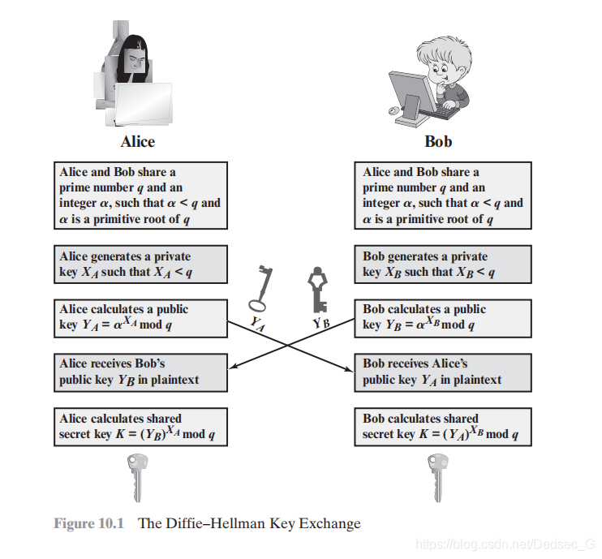

# DH密钥交换&Elgamal公钥加密&Elgamal数字签名

Elgamal可以实现公钥加密和数字签名两个应用，而Elgamal公钥加密算法实际上是基于DH密钥交换的，我们先看DH密钥交换算法。
一、Diffie-Hellman密钥交换
首先Diffie-Hellman的有效性是建立在计算离散对数很困难的这一基础上的。它的交换过程如下图所示：

接下来我们看一下它的具体过程：

第一步，Alice和Bob选定一个素数q和它的原根a，并公开。

第二步，用户A和用户B分别选定私钥 $X_A$和$X_B(X_A,X_B<q)$，并用公布的$q$和$a$分别计算:
$$Y_A=a^{X_A}mod q ,
Y_B=a^{X_B}mod q
$$
$Y_A$和$Y_B$作为A和B的公钥向对方公开。

第三步，A和B通过对方公开的公钥Y分别通过下式计算。
对A，A拿到B公布的公钥，集合自己的私钥，进行以下计算：
$$K_A=Y_B^{X_A}modq$$
对B，B拿到A公布的公钥，集合自己的私钥，进行以下计算：
$$K_B=Y_A^{X_B}modq$$
上面两个公式分别求得的$K_A$和$K_B$其实是等价的，也就是协商出来的密钥。以下原理可以证明相同：
$$K_A=Y_B^{X_A}modq=(a^{X_B}modq)^{X_A}modq=a^{X_BX_A}modq$$
$$K_B=Y_A^{X_B}modq=(a^{X_A}modq)^{X_B}modq=a^{X_AX_B}modq$$

我们可以看出$K_A=K_B=K$，K也就是Alice和Bob协商出来的密钥

所以，DH密钥交换的本质是：利用DH技术，只需要公开一些参数，不用密道来传输密钥，就可以得到一个用作对称加密的密钥K。

# 二、Elgamal的公钥加密方案
## 1 加密方案
EG加密是一种公钥的加密方案，其实是基于上面的DH的“密钥交换”来进行的一种密钥加密方案。

公钥加密方案是用发送方用公钥加密然后接收方用私钥解密。当然在EG中，会用公钥进行一次计算成K后，再用K进行加密。

EG加密算法可以分为密钥交换和明文加解密（对称）两部分，密钥交换就是用DH的方法进行的。而明文加解密则比较简单，因为是一个对称加密的。具体如下图所示：

在EG的公钥加密方案中，可以看到Bob利用Alice公布的公钥组进行一次变化形成K，然后用K消息形成密文$C_M$，然后计算自己的密钥协商部分$Y_B$。最后将这两块东西公布后，Alice可以利用自己的私钥计算出K，然后用K解密密文。

EG公钥加密可以理解成多对一的过程（很多人可以加密，但是只有自己解密），Alice可以和很多人用EG方案进行密钥的协商和加解密。这样Alice可以就可以用自己的一个私钥去和很多方完成这样的加解密过程。
EG的加密方案有一个优点在于：EG公钥密码是非确定性的，纵使Bob使用其相同的私钥和明文进行加密，每次加密出的结果也不尽相同，原因在于Bob所加密的密钥K以来Alice的私钥和随机参数。
如果用在链上的交易，那么发送方可以用EG公钥对交易信息进行加密，指定的接收方才能进行解密解开交易信息。在目前的Koton上，可以看到发送方是各个想进行交易的节点，而接收方其实是系统。
2 基于椭圆曲线的Elgamal
2.1 公私钥生成
设E是建立在有限域$$F_q$$上的一条椭圆曲线。在ECDSA中，选择椭圆曲线的参数$$ D=(q,a,b,G,n,h)$$,其中：
- a，b是椭圆曲线方程的参数，a,b在有限域中
- G为$$E(F_q)$$的一个基点，
- n为基点G的阶数:$$O(G)=n>max(2^{160},4\sqrt{q})$$
- h为余因子，且$$h=E（F_q）mod n$$
随机选择一个整数s（0<s<n）作为私钥保密，定义Q=d*G作为公钥。
则$$（E(F_q),G,Q）$$作为公钥，s为私钥
注：一般来说私钥随机数的生成需要一个伪随机函数和随机种子。
2.2 加密
假设m是哈希后的待签名消息，任意选取随机数k，$$1<=k<=n$$,计算X1=k*G（G是上面说的基点），X2=k*Q。加密：C=m*X2(mod n)
输入：签名消息m，随机数k，椭圆曲线的基点G，公钥Q
输出：(X1,C)，注意：这里需要把X2也公布出去
注：这里的X1和X2实际是坐标，因为G是坐标
2.3 解密
先用用私钥d求出X2=d*X1,接着$$m=C*X2^{-1}(mod n)$$

2.4 总结
一般来讲，选定了椭圆曲线，G，p，a,b等值会自然确定。一般在算法中，只需要输入对应的椭圆曲线，NIST向社会推荐了5条素域GF(p)上随机选取的椭圆曲线：
1.P192
 p=2192-264-1
 a=-3
 b=64210519 E59C80E7 0FA7E9AB 72243049 FEB8DEEC C146B9B1
 x=188DA80E B03090F6 7CBf20EB 43A18800 F4FF0AFD 82FF1012
 y=07192B95 FFC8DA78 631011ED 6B24CDD5 73F977A1 1E794811
 n=FFFFFFFF FFFFFFFF FFFFFFFF 99DEF836 146BC9B1 B4D22831
 h=1
2.p-224
 p=2224-296-1
 a=-3
 b=B4050A85 0C04B3AB F5413256 5044B0B7 D7BFD8BA 270B3943 2355FFB4
 x=B70E0CBD 6BB4BF7F 321390B9 4A03C1D3 56C21122 343280D6 115C1D21
 y=BD376388 B5F723FB 4C22DFE6 CD4375A0 5A074764 44D58199 85007E34
 n=FFFFFFFF FFFFFFFF FFFFFFFF FFFF16A2 E0B8F03E 13DD2945 5C5C2A3D
 h=1
3.p-556
 p=2256-2224+2192+296-1
 a=-3
 b=5AC635D8 AA3A93E7 B3EBBD55 769886BC 651D06B0 CC53B0F6 3BCE3C3E 27D2604B
 x=6B17D1F2 E12C4247 F8BCE6E5 63A440F2 77037D81 2DEB33A0 F4A13945 D898C296
 y=4FE342E2 FE1A7F9B 8EE7EB4A 7C0F9E16 2BCE3357 6B315ECE CBB64068 37BF51F5
 n=FFFFFFFF 00000000 FFFFFFFF FFFFFFFF BCE6FAAD A7179E84 F3B9CAC2 FC632551
 h=1
4.p-384
 p=2384-2128-296+232-1
 a=-3
 b=B3312FA7 E23EE7E4 988E056B E3F82D19 181D9C6E FE814112 0314088F 5013875A C656398D 8A2ED19D 2A85C8ED D3EC2AEF
 x=AA87CA22 BE8B0537 8EB1C71E F320AD74 6E1D3B62 8BA79B98 59F741E0 82542A38 5502F25D BF55296C 3A545E38 72760AB7
 y=3617DE4A 96262C6F 5D9E98BF 9292DC29 F8F41DBD 289A147C E9DA3113 B5F0B8C0 0A60B1CE 1D7E819D 7A431D7C 90EA0E5F
 n=FFFFFFFF FFFFFFFF FFFFFFFF FFFFFFFF FFFFFFFF FFFFFFFF C7634D81 F4372DDF 581A0DB2 48B0A77A ECEC196A CCC52973
 h=1
5.p-521
 p=2521-1
 a=-3
 b=00000051 953EB961 8E1C9A1F 929A21A0 B68540EE A2DA725B 99B315F3 B8B48991 8EF109E1 56193951 EC7E937B 1652C0BD 3BB1BF07 3573DF88 3D2C34F1 EF451FD4 6B503F00
 x=000000C6 858E06B7 0404E9CD 9E3ECB66 2395B442 9C648139 053FB521 F828AF60 6B4D3DBA A14B5E77 EFE75928 FE1DC127 A2FFA8DE 3348B3C1 856A429B F97E7E31 C2E5BD66
 y=00000118 39296A78 9A3BC004 5C8A5FB4 2C7D1BD9 98F54449 579B4468 17AFBD17 273E662C 97EE7299 5EF42640 C550B901 3FAD0761 353C7086 A272C240 88BE9476 9FD16650
 n=000001FF FFFFFFFF FFFFFFFF FFFFFFFF FFFFFFFF FFFFFFFF FFFFFFFF FFFFFFFF FFFFFFFF 51868783 BF2F966B 7FCC0148 F709A5D0 3BB5C9B8 899C47AE BB6FB71E 91386409
 h=1
三、Elgamal的数字签名方案
签名方案：签名是一个验证过程，和公钥加密方案相反，签名可以理解成一对多的过程。在签名方案中，发送方用自己的私钥签名，接收方用公钥验证。
EG签名方案本质也是加解密的过程，接收方去验证解密后的消息和原消息是否相同，从而保证消息的完整性和真实性。
Elgamal如何实现数字签名我概括为三个部分：公钥生成、签名、验签
1、公钥生成
这里的公钥生成和EG公钥密码体制差不多，Alice选择一个素数q和其原根a，用一个随机私钥$$X_A$$（$$0,相当于密钥1）生成公钥：
$$Y_A=a^{X_A}modq$$
Alice会将$$（Y_A,a,q）$$作为一组公钥公布出去。
2、签名
Alice对消息m进行签名，首先Alice会选一个随机数k（相当于密钥2），用k进行以下签名：
$$sig_k(m,k)=(r,s)$$
其中：
$$r=a^kmodq, s=(m-X_A*r)k^{-1}mod(q-1)$$
签名完成后，Alice会将$$（m,r,s）$$作为一组签名公布出去
3、验签
Bob拿到Alice的公钥和签名之后，以下式子成立则完成验签：
$$Y_A^r*r^s=a^mmodq$$
4、推导
我们从验证公式反推签名，看下为什么上面这个式子能证明签名成功。
首先验签公式可以写成如下：
$$a^m=Y_A^r*r^smodq$$
我们把$$Y_A$$和$$r$$展开，但是指数上的$$r$$不展开。
$${Y_A}^r=(a^{X_A}modq)^r,r=(a^kmodq)^s$$
将其带入到上面的验签公式中：
$$a^m=a^{X_A*r}modq*a^{k*s}modq=a^{X_A*r+k*s}modq$$
因为a是模q的本原元，因此，当且仅当指数是一个模q-1的等式，即：
$$m=(X_A*r+k*s)mod (q-1)$$时，上式成立。
所以，$$ s=(m-X_A*r)k^{-1}mod(q-1)$$
5、总结
Alice使用私钥$$X_A$$生成公钥$$Y_A$$和一个随机数k（可以看成私钥2）计算签名，然后公开6个参数（$$Y_A$$,a,q）和（m,r,s），对方则可完成验签。
所以，看起来本质上还是一个解密看解密后的m'是否和原来的m保持一致的过程。
在链上交易中，可以利用EG进行签名，这个签名包括两部分，一个是账户信息的签名，一个是交易金额的签名。各个想进行交易的人对其签名，然后系统或者对方进行验签。
四、Elgamal同态方案
1、乘法同态
基于EG的公钥加密的基础上，有乘法同态的性质如下：
在上面的EG公钥加密方案中，假设我们要加密两个消息m1和m2，Bob选定的私钥分别是$$X_{B1}和X_{B2}$$我们可以将加密方案分别写成：
$$E（m1）=(a^{X_{B1}}modq,m1*Y_A^{X_{B1}}modq)$$
$$E（m2）=(a^{X_{B2}}modq,m1*Y_A^{X_{B2}}modq)$$
以上公式我们省略了中间符号，前一项是Bob需要公布的密钥协商部分，后面一项是根据Alice密钥私钥部分和自己的私钥加密的密文。所以两个相乘如下：
$$E（m1）*E（m2）=(a^{X_{B1}+X_{B2}}modq,m1*m2*Y_A^{X_{B1}+X_{B2}}modq)$$
如果对于明文m1,m2他们相乘后再EG公钥加密，Bob的私钥为$$X_{B1}+X_{B2}$$如下：
$$E（m1*m2）=(a^{X_{B1}+X_{B2}}modq,m1*m2*Y_A^{X_{B1}+X_{B2}}modq)$$
我们可以看到：$$E(m1)*E(m2)=E(m1*m2)$$
即Elgamal公钥加密满足乘法同态性，注意这里的私钥加密是加法的。
即相当于用随$$X_{B1}+X_{B2}$$机数对m1*m2加密,即ElGamal加密满足乘法同态，而且，该乘法同态没有次数限制。可以进行任意次乘法运算。
2、指数上的加法同态
